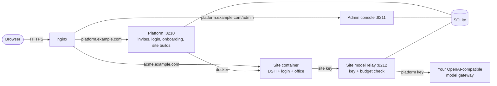

# Swarm

[繁體中文](README.zh-TW.md) | [简体中文](README.zh-CN.md) | English

An AI office you can host yourself. You run one platform; each customer you invite gets an isolated [DeepSeek Harness (DSH)](https://github.com/deepseek-ai/deepseek-harness) site that already holds an office template: companies, AI staff roles, schedules and a place for their own keys.


Full video with captions: [docs/media/demo.mp4](docs/media/demo.mp4). The demo runs on a throwaway install with a scripted model, so the AI's replies are canned.

> The UI text is currently in Traditional Chinese.

## What it does

- **Invite-only sites.** In the admin console you create a customer, pick an office template, set a monthly model quota and send a single-use invite link. The customer picks their own username and password.
- **One container per customer.** The platform builds the site by itself: a DSH container with its own login, data and workspace, an nginx route and (optionally) a DNS record. Deleting the customer removes all of it.
- **Onboarding page with a setup copilot.** The customer sees setup progress and the site build live. The copilot explains the next step from what the platform actually recorded, and does not make up progress.
- **Into the site without a second password.** **Open my site** hands the signed-in customer over with a single-use ticket.
- **The platform's model key never enters a site.** Each site gets its own starter key, which only works against the platform's relay. The relay checks that key and the site's monthly budget, then forwards the call with the platform key.
- **An office ready on first visit.** The workspace starts with the office template (an `AGENTS.md`, a getting-started guide, a place for companies). Customers can add their own model keys later.
- **Conversation sharing.** [dsh-share-room](https://github.com/yillkid/dsh-share-room) is installed in every site, so a customer can invite guests into a conversation.
- **Operator view.** One page lists every customer with their site, quota policy and template. When a customer asks for a human, the operator answers from the same console.

## Screenshots

| Operator | Customer |
|---|---|
|  |  |
|  |  |

Inside the customer's own site: the reply comes through the platform relay, and the usage counts toward the monthly quota.


## How it fits together



Each site sits on an isolated Docker network. The relay is the only host port it can reach: no other host ports, private networks or cloud metadata. The platform never runs `sudo`. Two small root units do the privileged work, one for the firewall and one that applies nginx configs. Details: [docs/architecture.md](docs/architecture.md) and [docs/security.md](docs/security.md).

## Before you run it

- **Use a host dedicated to Swarm.** The platform user is in the `docker` group, which is equivalent to root.
- **Containers are not VMs.** All customers share one kernel and one Docker daemon. DSH's in-site sandbox does not work in a container, so the container, network and firewall are the only containment.
- **Sites can reach the internet.** A customer's AI can send that customer's data anywhere.
- **You pay for the starter model.** Every site's starter calls go through your gateway on your key. Monthly caps are enforced, but token counts are estimates.
- **TLS is yours.** Nothing here terminates TLS. Put certbot, a load balancer or a tunnel in front.

The full list is under [Known limits](docs/security.md#known-limits).

## Install

You need a Linux host (Ubuntu 22.04 or similar) with Docker 24+, nginx and Python 3.10+, about 2 GB of disk for the site image, and an OpenAI-compatible model gateway (for example LiteLLM). Point `platform.<domain>` and `*.<domain>` at the host.

```sh
sudo git clone https://github.com/towNingtek/swarm /opt/swarm
cd /opt/swarm
sudo python3 -m venv .venv && sudo .venv/bin/pip install -r requirements.txt
sudo docker build -f site/Dockerfile -t swarm-site:latest .
sudo deploy/install.sh
sudo editor /etc/swarm/platform.env          # domain, origins, model gateway
sudo editor /etc/swarm/secrets/model-key
sudo cp deploy/nginx/swarm-platform.conf.example /etc/nginx/conf.d/swarm-platform.conf
sudo editor /etc/nginx/conf.d/swarm-platform.conf && sudo nginx -t && sudo systemctl reload nginx
sudo deploy/install.sh --start
```

Then open `https://platform.<domain>/admin` and sign in with the password in `/etc/swarm/secrets/admin-password`. The rest of the settings, logs and the first customer are covered in [deploy/README.md](deploy/README.md).

The whole install is tested from scratch in a throwaway container: `bash deploy/tests/clean-install/run.sh`.

## Repository

| Path | What it is |
|---|---|
| [`platform/`](platform/) | The platform, the admin console and the site model relay |
| [`site/`](site/) | The site engine and the DSH site image |
| [`office-template/`](office-template/) | The office every new site starts with |
| [`plugins/`](plugins/) | DSH plugins kept here (branding) |
| [`deploy/`](deploy/) | Install on one host with systemd, Docker and nginx |
| [`demo/`](demo/) | The scripted model and recording scripts behind the demo above |
| [`docs/`](docs/) | Architecture, security model, HTTP API, design records |

## Development

```sh
bash scripts/test.sh          # every suite; Python 3.10+, Node 22
```

The platform is Python (FastAPI) with server-rendered pages. The site image is DSH plus profile patches; DSH itself is not modified.

## Name

The idea of a swarm of cooperating agents was inspired by [openai/swarm](https://github.com/openai/swarm). This is an independent project and is not affiliated with OpenAI.

## Security

Please report vulnerabilities privately. See [SECURITY.md](SECURITY.md).

## License

[MIT](LICENSE) © towNingtek inc.
