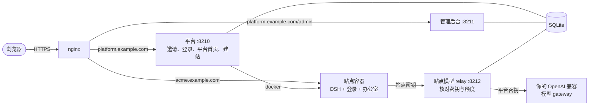

# Swarm

[繁體中文](README.zh-TW.md) | 简体中文 | [English](README.md)

一套可以自己部署的 AI 办公室。你部署一个平台，邀请客户进来；每位客户拿到一个隔离的 [DeepSeek Harness（DSH）](https://github.com/deepseek-ai/deepseek-harness) 站点，里面已经放好办公室模板：公司、AI 员工角色、定时任务，以及存放自己密钥的地方。


带字幕的完整视频：[docs/media/demo.mp4](docs/media/demo.mp4)。演示运行在一次性的测试安装上，模型是脚本，AI 的回复是预先写好的。

> 界面目前只有繁体中文。

## 功能

- **邀请制开站。** 运营者在管理后台创建客户、选择办公室模板、设置每月模型额度，再发出一次性的邀请链接。用户名和密码由客户自己设置。
- **每位客户一个容器。** 站点由平台自己创建：一个 DSH 容器，有自己的登录、数据和工作区，加上 nginx 路由和 DNS 记录（可选）。删除客户时这些都会一起移除。
- **带设置助手的平台首页。** 客户能看到设置进度和建站状态。设置助手只根据平台实际记录的状态说明下一步，不会自己编造进度。
- **进站不用第二套密码。** 点“进入我的站点”，平台会用一次性的入场票把已登录的客户交给站点。
- **平台的模型密钥不会进入站点。** 每个站点有自己的起步密钥，而且只能在平台的 relay 上使用。relay 核对密钥和这个站点的每月额度，再用平台密钥转发。
- **第一次进站，办公室就在。** 工作区一开始就有办公室模板（`AGENTS.md`、新手指南、存放公司的文件夹）。客户之后可以接入自己的模型密钥。
- **对话分享。** 每个站点都装了 [dsh-share-room](https://github.com/yillkid/dsh-share-room)，客户可以邀请访客一起查看一段对话。
- **运营者总览。** 一页列出每位客户的站点、额度策略和模板。客户需要人工时，运营者也在同一个后台回复。

## 截图

| 运营者 | 客户 |
|---|---|
|  |  |
|  |  |

在客户自己的站点里：回复经过平台的 relay，用量计入每月额度。


## 架构



每个站点都在隔离的 Docker 网络里，主机上唯一能连到的是 relay，其他主机端口、内网和云 metadata 都连不到。平台本身从不执行 `sudo`，需要 root 的事交给两个小单元：一个管防火墙，一个应用 nginx 配置。细节见 [docs/architecture.md](docs/architecture.md) 和 [docs/security.md](docs/security.md)（英文）。

## 部署前请先了解

- **请使用专门给 Swarm 的主机。** 平台用户在 `docker` 组里，等同 root。
- **容器不是虚拟机。** 所有客户共用同一个内核和同一个 Docker daemon。DSH 自己的沙箱在容器里无法运行，所以隔离只靠容器、网络和防火墙。
- **站点可以访问外网。** 客户的 AI 可以把该客户的数据发送到任何地方。
- **起步模型的费用由你承担。** 每个站点的起步调用都经过你的 gateway、用你的密钥。每月上限会强制执行，但 token 数是估算的。
- **TLS 需要自己处理。** 这个仓库不处理 TLS，请在前面放 certbot、负载均衡或 tunnel。

完整清单见[已知限制](docs/security.md#known-limits)。

## 安装

需要：一台 Linux 主机（Ubuntu 22.04 或类似版本），装有 Docker 24 以上、nginx、Python 3.10 以上；站点镜像约需 2 GB 磁盘；一个 OpenAI 兼容的模型 gateway（例如 LiteLLM）。把 `platform.<domain>` 和 `*.<domain>` 指向这台主机。

```sh
sudo git clone https://github.com/towNingtek/swarm /opt/swarm
cd /opt/swarm
sudo python3 -m venv .venv && sudo .venv/bin/pip install -r requirements.txt
sudo docker build -f site/Dockerfile -t swarm-site:latest .
sudo deploy/install.sh
sudo editor /etc/swarm/platform.env          # 域名、origin、模型 gateway
sudo editor /etc/swarm/secrets/model-key
sudo cp deploy/nginx/swarm-platform.conf.example /etc/nginx/conf.d/swarm-platform.conf
sudo editor /etc/nginx/conf.d/swarm-platform.conf && sudo nginx -t && sudo systemctl reload nginx
sudo deploy/install.sh --start
```

然后打开 `https://platform.<domain>/admin`，用 `/etc/swarm/secrets/admin-password` 里的密码登录。其他设置、日志和第一位客户的创建方式见 [deploy/README.md](deploy/README.md)（英文）。

整套安装流程会在一次性容器里从零测试：`bash deploy/tests/clean-install/run.sh`。

## 目录

| 路径 | 内容 |
|---|---|
| [`platform/`](platform/) | 平台、管理后台、站点模型 relay |
| [`site/`](site/) | 建站引擎与 DSH 站点镜像 |
| [`office-template/`](office-template/) | 新站点一开就有的办公室 |
| [`plugins/`](plugins/) | 放在本仓库的 DSH 插件（品牌外观） |
| [`deploy/`](deploy/) | 用 systemd、Docker、nginx 在一台主机上安装 |
| [`demo/`](demo/) | 上面演示用的脚本模型和录屏脚本 |
| [`docs/`](docs/) | 架构、安全模型、HTTP API、设计记录（英文） |

## 开发

```sh
bash scripts/test.sh          # 全部测试；Python 3.10 以上、Node 22
```

平台用 Python（FastAPI），页面由服务器生成。站点镜像是 DSH 加上 profile patch，不修改 DSH 本身。

## 名称

“一群协作的 agent”这个概念受 [openai/swarm](https://github.com/openai/swarm) 启发。本项目独立开发，与 OpenAI 无关。

## 安全

发现漏洞请私下报告，见 [SECURITY.md](SECURITY.md)。

## 许可

[MIT](LICENSE) © towNingtek inc.
