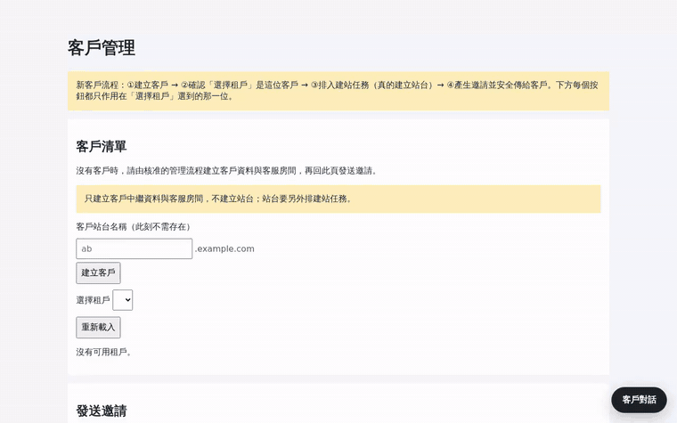
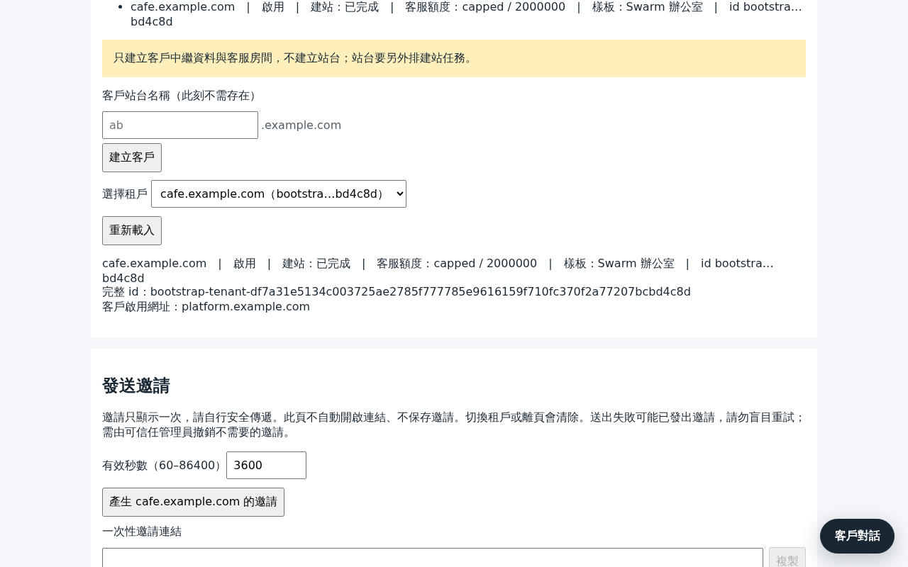
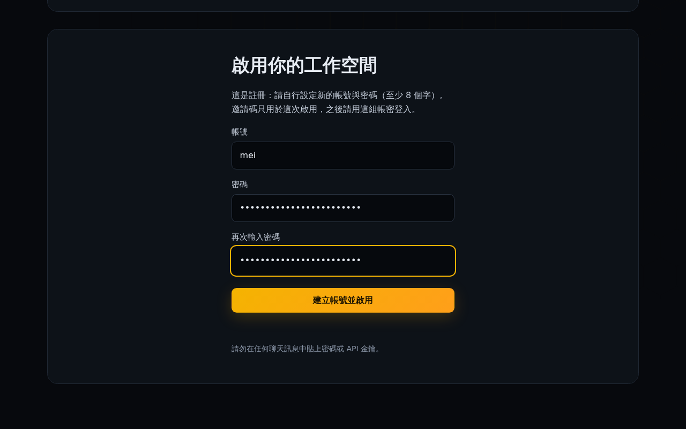
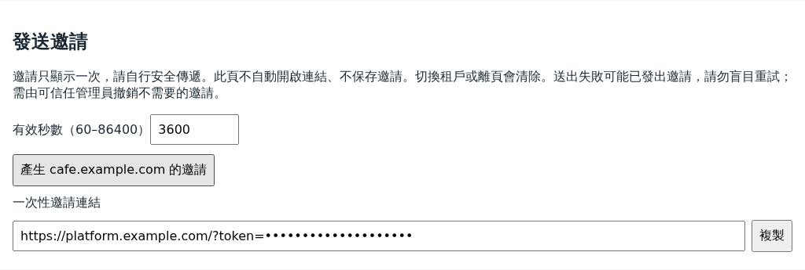
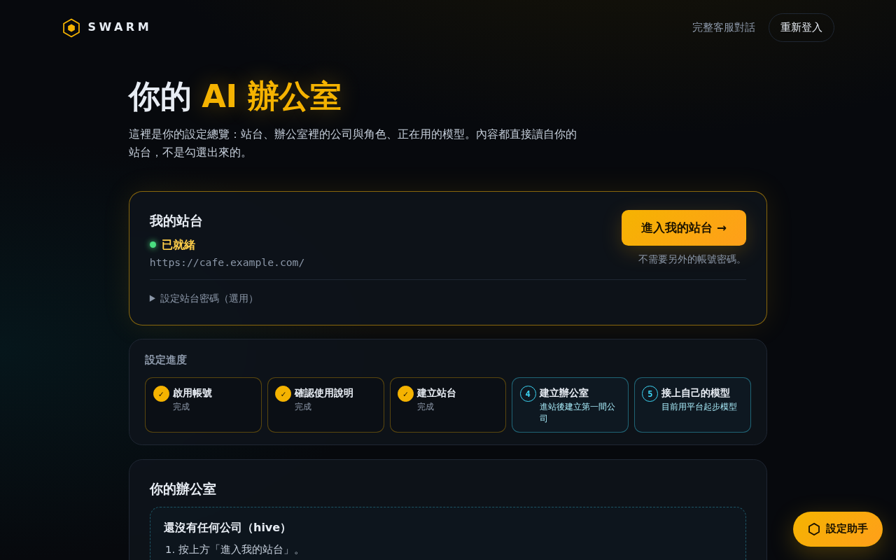
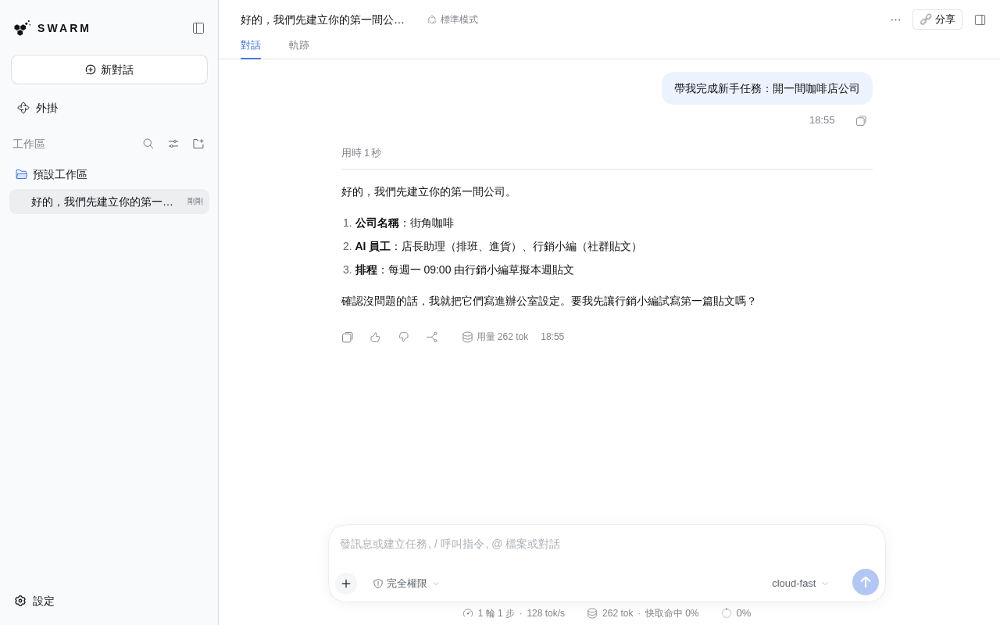
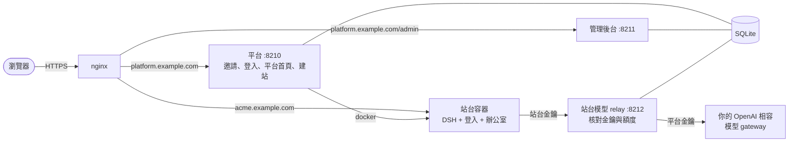

# Swarm

繁體中文 | [简体中文](README.zh-CN.md) | [English](README.md)

一套可以自己架設的 AI 辦公室。你架一個平台，邀請客戶進來；每位客戶拿到一個隔離的 [DeepSeek Harness（DSH）](https://github.com/deepseek-ai/deepseek-harness) 站台，裡面已經放好辦公室範本：公司、AI 員工角色、排程，以及放自己金鑰的地方。



含字幕的完整影片：[docs/media/demo.mp4](docs/media/demo.mp4)。示範跑在一次性的測試安裝上，模型是腳本，AI 的回覆是預先寫好的。

> 介面目前只有繁體中文。

## 功能

- **邀請制開站。** 營運者在管理後台建立客戶、選辦公室樣板、設定每月模型額度，再送出一次性的邀請連結。帳號密碼由客戶自己設定。
- **每位客戶一個容器。** 站台由平台自己建：一個 DSH 容器，有自己的登入、資料和工作區，加上 nginx 路由和 DNS 紀錄（可選）。刪除客戶時這些都會一起移除。
- **有設定助手的平台首頁。** 客戶看得到設定進度和建站狀態。設定助手只根據平台實際記錄的狀態說明下一步，不會自己編造進度。
- **進站不用第二組密碼。** 按「進入我的站台」，平台會用一次性的入場票把登入中的客戶交給站台。
- **平台的模型金鑰不會進站台。** 每個站台有自己的起步金鑰，而且只能對平台的 relay 使用。relay 核對金鑰和這個站台的每月額度，再用平台金鑰轉送。
- **第一次進站，辦公室就在。** 工作區一開始就有辦公室範本（`AGENTS.md`、新手指南、放公司的資料夾）。客戶之後可以接上自己的模型金鑰。
- **對話分享。** 每個站台都裝了 [dsh-share-room](https://github.com/yillkid/dsh-share-room)，客戶可以邀請訪客一起看一段對話。
- **營運者總覽。** 一頁列出每位客戶的站台、額度政策和樣板。客戶要找真人時，營運者也在同一個後台回覆。

## 截圖

| 營運者 | 客戶 |
|---|---|
|  |  |
|  |  |

在客戶自己的站台裡：回覆經過平台的 relay，用量計入每月額度。



## 架構



每個站台都在隔離的 Docker 網路裡，主機上唯一連得到的是 relay，其他主機埠、內網和雲端 metadata 都連不到。平台本身從不執行 `sudo`，需要 root 的事交給兩個小單元：一個管防火牆，一個套用 nginx 設定。細節見 [docs/architecture.md](docs/architecture.md) 和 [docs/security.md](docs/security.md)（英文）。

## 架設前請先了解

- **請用專門給 Swarm 的主機。** 平台使用者在 `docker` 群組裡，等同 root。
- **容器不是 VM。** 所有客戶共用同一個核心和同一個 Docker daemon。DSH 自己的沙箱在容器裡無法運作，所以隔離只靠容器、網路和防火牆。
- **站台可以連外網。** 客戶的 AI 可以把該客戶的資料送到任何地方。
- **起步模型的費用由你負擔。** 每個站台的起步呼叫都經過你的 gateway、用你的金鑰。每月上限會強制執行，但 token 數是估算的。
- **TLS 要自己處理。** 這個 repo 不處理 TLS，請在前面放 certbot、load balancer 或 tunnel。

完整清單見[已知限制](docs/security.md#known-limits)。

## 安裝

需要：一台 Linux 主機（Ubuntu 22.04 或類似版本），裝有 Docker 24 以上、nginx、Python 3.10 以上；站台 image 約需 2 GB 磁碟；一個 OpenAI 相容的模型 gateway（例如 LiteLLM）。把 `platform.<domain>` 和 `*.<domain>` 指到這台主機。

```sh
sudo git clone https://github.com/towNingtek/swarm /opt/swarm
cd /opt/swarm
sudo python3 -m venv .venv && sudo .venv/bin/pip install -r requirements.txt
sudo docker build -f site/Dockerfile -t swarm-site:latest .
sudo deploy/install.sh
sudo editor /etc/swarm/platform.env          # 網域、origin、模型 gateway
sudo editor /etc/swarm/secrets/model-key
sudo cp deploy/nginx/swarm-platform.conf.example /etc/nginx/conf.d/swarm-platform.conf
sudo editor /etc/nginx/conf.d/swarm-platform.conf && sudo nginx -t && sudo systemctl reload nginx
sudo deploy/install.sh --start
```

接著打開 `https://platform.<domain>/admin`，用 `/etc/swarm/secrets/admin-password` 裡的密碼登入。其他設定、日誌和第一位客戶的建立方式見 [deploy/README.md](deploy/README.md)（英文）。

整套安裝流程會在一次性容器裡從零測試：`bash deploy/tests/clean-install/run.sh`。

## 目錄

| 路徑 | 內容 |
|---|---|
| [`platform/`](platform/) | 平台、管理後台、站台模型 relay |
| [`site/`](site/) | 建站引擎與 DSH 站台 image |
| [`office-template/`](office-template/) | 新站台一開就有的辦公室 |
| [`plugins/`](plugins/) | 放在本 repo 的 DSH 外掛（品牌外觀） |
| [`deploy/`](deploy/) | 用 systemd、Docker、nginx 在一台主機上安裝 |
| [`demo/`](demo/) | 上面示範用的腳本模型和錄影腳本 |
| [`docs/`](docs/) | 架構、安全模型、HTTP API、設計紀錄（英文） |

## 開發

```sh
bash scripts/test.sh          # 全部測試；Python 3.10 以上、Node 22
```

平台用 Python（FastAPI），頁面由伺服器產生。站台 image 是 DSH 加上 profile patch，不修改 DSH 本身。

## 名稱

「一群協作的 agent」這個概念啟發自 [openai/swarm](https://github.com/openai/swarm)。本專案獨立開發，與 OpenAI 無關。

## 安全

發現漏洞請私下回報，見 [SECURITY.md](SECURITY.md)。

## 授權

[MIT](LICENSE) © towNingtek inc.
