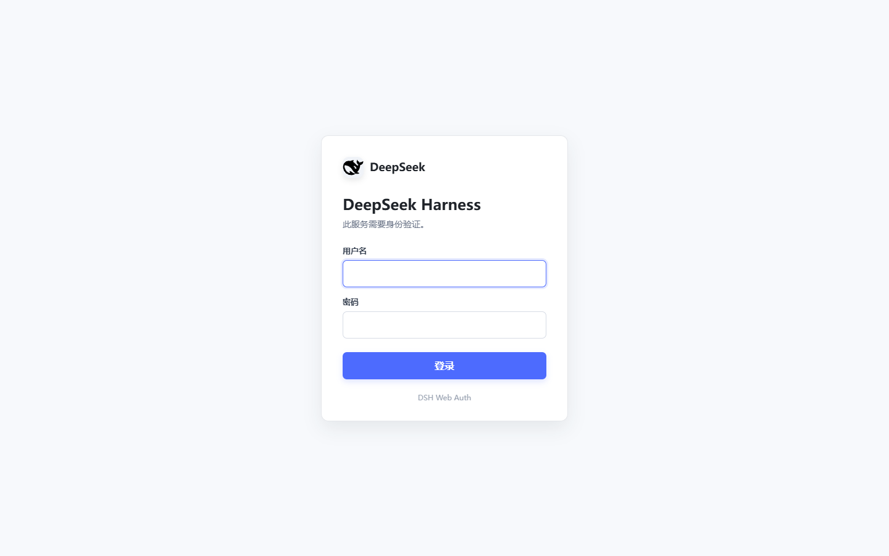

# dsh-web-auth

[](https://www.npmjs.com/package/@summersec/dsh-web-auth)
[](https://nodejs.org/)
[](./LICENSE)
[](https://github.com/topics/dsh-plugin)

Transport-level authentication for the [DeepSeek Harness](https://github.com/deepseek-ai) (DSH) Web GUI.

Official DSH `webserver` serves the GUI, plugin bundles, `/api`, SSE, and WebSocket traffic without a login boundary. This plugin **disables** that unauthenticated carrier and replaces it with a drop-in `webServer` service that authenticates every request **before** it reaches application routes.

中文文档：[README.zh-CN.md](./README.zh-CN.md)

---

## Login page



---

## Why this exists

DSH’s stock web host is convenient for local use, but it is not a product auth layer:

- Binding to `0.0.0.0` or putting the port behind a reverse proxy can expose the full control surface.
- A frontend-only “login page” does not protect `/api`, static plugin assets, SSE, or WebSocket upgrades.
- Session and password handling need to live on the HTTP carrier itself.

`@summersec/dsh-web-auth` sits at the transport layer:

1. Disable `@deepseek-ai/dsh-host-webserver`.
2. Insert `webserver-auth` with the same `ctx.webServer` contract (`register`, `registerUpgrade`, `registerFallback`, `tapIndex`, `host`, `port`).
3. Gate HTTP and upgrade traffic with a server-side session cookie.

Other plugins keep registering routes as usual; they do not need to know auth exists.

---

## Features

| Area | Behavior |
| --- | --- |
| Coverage | HTTP routes **and** WebSocket / HTTP upgrade paths |
| Default mode | `always` — login required even on `127.0.0.1` |
| Optional mode | `non-loopback` — skip auth only when bound to loopback |
| Passwords | scrypt hashes (`scrypt$N$r$p$salt$key`); plaintext env only for temporary use |
| Sessions | 32-byte random tokens, in-memory store, sliding TTL |
| Cookies | `HttpOnly`, `SameSite=Strict`, optional `Secure` |
| Abuse control | Per-client-IP login attempt limiter with `Retry-After` |
| Login UX | Built-in `/auth/login` page (light/dark), form + JSON body |
| Hardening | Origin check on login/logout, open-redirect sanitization, CSP and frame denial on auth responses |

---

## Requirements

- **Node.js** `>= 22`
- **DeepSeek Harness** with a `web` profile (peer: `@deepseek-ai/cordis` `^4.0.1`)
- A password **hash** in the process environment (recommended), or a temporary plaintext password

---

## Quick start

```powershell
# 1) Generate a random password + scrypt hash (save the password offline)
npx --yes @summersec/dsh-web-auth generate

# 2) Export the hash for this shell session (do not commit it)
$env:WEB_AUTH_PASSWORD_HASH = 'scrypt$...'
$env:WEB_AUTH_USERNAME = 'admin'

# 3) Install into the web profile
dsh plugin --profile web add @summersec/dsh-web-auth

# 4) Start the GUI
dsh web
```

Open the usual DSH URL. Unauthenticated browser navigations redirect to `/auth/login`. API and other non-HTML clients receive `401` JSON:

```json
{ "error": "authentication_required" }
```

After login you get a session cookie and continue to the original path. The injected browser bootstrap makes same-origin API, SSE, and plugin requests use that session cookie explicitly. If an in-memory session expires or the service restarts, a JSON `authentication_required` response sends the browser back to the login page instead of leaving the plugin in a silent transport-failure state.

> **Do not** put the password or hash into the project `.env` if that file is shared or committed. Prefer the process environment, a secrets manager, or a private host-level env file outside the repo.

---

## Install from source

```powershell
git clone https://github.com/SummerSec/dsh-web-auth.git
cd dsh-web-auth
npm install

node .\bin\dsh-web-auth.js generate
$env:WEB_AUTH_PASSWORD_HASH = 'scrypt$...'

# From the parent directory that hosts your DSH workspace, or via local path:
dsh plugin --profile web add <path-to-dsh-web-auth>
dsh web
```

Hash an existing password (minimum **12** characters):

```powershell
$env:WEB_AUTH_PASSWORD = 'your-long-passphrase'
node .\bin\dsh-web-auth.js hash-password
Remove-Item Env:WEB_AUTH_PASSWORD
```

Or pipe stdin (the CLI never accepts the password as a command-line argument):

```powershell
'your-long-passphrase' | node .\bin\dsh-web-auth.js hash-password
```

---

## Authentication modes

| `authMode` / `WEB_AUTH_MODE` | When auth runs |
| --- | --- |
| `always` (**default**) | Always, including `host: 127.0.0.1` |
| `non-loopback` | Only when `host` is not `127.0.0.1` (e.g. a concrete LAN IP) |

```powershell
# Default: always require login
$env:WEB_AUTH_MODE = 'always'
dsh web

# Loopback without login; binding any non-loopback address gates automatically
$env:WEB_AUTH_MODE = 'non-loopback'
dsh web --host 192.168.1.20
```

If authentication is active and neither `passwordHash` nor `password` is configured, the plugin **throws at startup** so you never ship an open server by accident.

---

## Environment variables

The bundle (`cordis.patch.yml`) wires these into plugin config:

| Variable | Default | Description |
| --- | --- | --- |
| `WEB_AUTH_MODE` | `always` | `always` or `non-loopback` |
| `WEB_AUTH_USERNAME` | `admin` | Login username |
| `WEB_AUTH_PASSWORD_HASH` | _(none)_ | Preferred scrypt hash from `generate` / `hash-password` |
| `WEB_AUTH_PASSWORD` | _(none)_ | Plaintext password for temporary / lab use only |

Prefer `WEB_AUTH_PASSWORD_HASH`. Keep `WEB_AUTH_PASSWORD` for short-lived local experiments.

---

## Advanced configuration

The bundle:

1. Sets the stock `webserver` row to `disabled: true`.
2. Inserts `webserver-auth` with name `@summersec/dsh-web-auth`.

DSH patches replace config **as a whole**. To override advanced fields, restate the full `webserver-auth` block in the profile patch (e.g. profile `cordis.patch.yml`):

```yaml
- id: webserver-auth
  name: '@summersec/dsh-web-auth'
  inject: [webStartup]
  config:
    host: !!js ctx.webStartup.host ?? '127.0.0.1'
    port: !!js ctx.webStartup.port ?? 3080
    authMode: always
    username: admin
    passwordHash: !!js process.env.WEB_AUTH_PASSWORD_HASH
    sessionTtlMinutes: 720
    maxAttempts: 5
    attemptWindowSeconds: 300
    secureCookie: auto
    trustProxy: false
```

### Config reference

| Field | Type / values | Default | Notes |
| --- | --- | --- | --- |
| `host` | IP or host name | `127.0.0.1` | Listen address; any non-loopback bind forces auth |
| `port` | `0`–`65535` | `3080` | Listen port; `0` for ephemeral |
| `authMode` | `always` \| `non-loopback` | `always` | See [Authentication modes](#authentication-modes) |
| `username` | string | `admin` | Single shared account |
| `password` | string | — | Plaintext; avoid in production |
| `passwordHash` | `scrypt$...` | — | Required format from the CLI |
| `sessionTtlMinutes` | `1`–`43200` | `720` (12h) | Sliding window on each authenticated request |
| `maxAttempts` | `1`–`1000` | `5` | Failed logins per IP per window |
| `attemptWindowSeconds` | `1`–`86400` | `300` | Attempt window length |
| `secureCookie` | `auto` \| `always` \| `never` | `auto` | When to set the `Secure` flag |
| `trustProxy` | boolean | `false` | Trust `X-Forwarded-*` only behind a locked-down proxy |

### `secureCookie` and `trustProxy`

| Scenario | Suggested settings |
| --- | --- |
| Local HTTP on loopback | `secureCookie: auto`, `trustProxy: false` |
| Direct TLS on the Node process | `secureCookie: auto` (sets `Secure` when the socket is encrypted) |
| HTTPS terminated at nginx / Caddy / Cloudflare | `secureCookie: auto` or `always`, **`trustProxy: true`**, and **only** the proxy may reach DSH’s port |

If `trustProxy` is true while the port is reachable by untrusted clients, attackers can spoof `X-Forwarded-For` / `X-Forwarded-Proto` and weaken IP limits or cookie security. Lock network access first.

---

## Brute-force protection

Failed logins are limited by client IP. With the default configuration, an IP may fail 5 times within 300 seconds. Further attempts receive `429 Too Many Requests` and a `Retry-After` header until the window expires. A successful login clears that IP's failure count.

Configure the threshold with:

```yaml
maxAttempts: 5
attemptWindowSeconds: 300
```

The limiter is intentionally small and local:

- Counters are stored in process memory, so a restart clears them and multiple instances do not share state.
- It limits IP addresses, not accounts. Attackers rotating source IPs can avoid a single-IP threshold.
- With `trustProxy: false`, the socket address is used. With `trustProxy: true`, the first `X-Forwarded-For` value is trusted, so the DSH port must only accept traffic from the configured proxy.

For an Internet-facing deployment, keep this limiter enabled and add rate limiting at the reverse proxy or firewall. It is not a replacement for HTTPS, network isolation, or a strong password.

---

## Auth HTTP API

| Method | Path | Purpose |
| --- | --- | --- |
| `GET` / `HEAD` | `/auth/login` | Login HTML page; `?next=/path` for post-login redirect |
| `POST` | `/auth/login` | Authenticate (`application/x-www-form-urlencoded` or `application/json`) |
| `POST` | `/auth/logout` | Clear session cookie and redirect to login |
| `GET` | `/auth/status` | `{ authenticated, required, username? }` — `200` or `401` |

### Login body (JSON)

```json
{
  "username": "admin",
  "password": "...",
  "next": "/"
}
```

### Behavior notes

- Successful form login responds with `303` + `Set-Cookie` (`dsh_web_auth`) and `Location` set to a **sanitized** relative path (blocks `//evil`, absolute URLs, and header-injection characters).
- Failed login returns the login page with an error message (`401`) or rate-limit page (`429` + `Retry-After`).
- Login and logout require a matching `Origin` when the header is present (CSRF-oriented check).
- WebSocket upgrades without a valid session are closed with `401` and a JSON error body.
- Auth HTML responses set `Cache-Control: no-store`, a strict CSP, `X-Frame-Options: DENY`, and related headers.

---

## How it fits into DSH

```text
Browser / client
       │
       ▼
┌──────────────────────┐
│  dsh-web-auth        │  ← session cookie / login routes
│  (Authenticated      │
│   WebServer service) │
└──────────┬───────────┘
           │ authenticated only
           ▼
  GUI · plugin bundles · /api · SSE · WS
  (registered via ctx.webServer.*)
```

Compatible surface with the stock web server service:

- `register({ kind, path, handler })`
- `registerUpgrade({ path, handler })`
- `registerFallback(handler)`
- `tapIndex(transform)`
- `host` / `port` getters

---

## CLI

Package binary: `dsh-web-auth`

```text
dsh-web-auth generate
  Print WEB_AUTH_PASSWORD=... and WEB_AUTH_PASSWORD_HASH=...

dsh-web-auth hash-password
  Read password from WEB_AUTH_PASSWORD or stdin; print scrypt hash only
```

### Password hashing algorithm

The CLI uses Node.js `crypto.scryptSync`, an RFC 7914 scrypt password-based key derivation function. It is designed to make large-scale password guessing more expensive in both CPU time and memory than a fast general-purpose hash.

For each password, the plugin:

1. Generates a new 16-byte random salt with `crypto.randomBytes`.
2. Derives a 64-byte key with `N=16384`, `r=8`, and `p=1`.
3. Stores the algorithm name, parameters, salt, and derived key in one string. The salt and key use unpadded Base64URL encoding.
4. During login, derives the key again with the stored parameters and compares it with `crypto.timingSafeEqual`.

The password itself is not stored, and the encoded value is not encryption that can be decrypted. Passwords passed to the hashing CLI must contain at least **12** characters.

Stored format:

```text
scrypt$N$r$p$<salt-base64url>$<key-base64url>
```

Default parameters: `N=16384` (CPU/memory cost), `r=8` (block size), `p=1` (parallelization), a 64-byte derived key, and a 16-byte salt. The Node.js scrypt memory ceiling is set to at least 64 MiB for these operations.

---

## Verification

```powershell
npm run check          # syntax check + unit tests
npm pack --dry-run     # publish file set
dsh --profile web --dump-config
```

In the dump, confirm:

- Stock `webserver` has `disabled: true`
- A `webserver-auth` row exists with name `@summersec/dsh-web-auth`
- Startup logs do not show `FAILED`

Manual smoke:

1. Open the GUI without a cookie → redirect to `/auth/login`.
2. Log in → land on the app; cookie `dsh_web_auth` present.
3. `GET /auth/status` with cookie → `authenticated: true`.
4. `POST /auth/logout` → session cleared.
5. Exceed failed attempts → `429` until the window resets.

---

## Publish to npm

Package name: `@summersec/dsh-web-auth` (public scope).

Publishing is performed only by the repository's GitHub Actions workflow. **Do not use local `npm publish`** as a release path.

Before the first release, add a repository Actions secret named `NPM_TOKEN`. It must be an npm token with permission to publish `@summersec` packages, and the npm organization’s 2FA and CI-publishing policy must permit GitHub Actions to use that token.

Release through one of these workflow entry points:

1. Create a GitHub Release with a `vX.Y.Z` tag that exactly matches `package.json`'s `X.Y.Z` version.
2. Run **Publish Node.js Package** with `workflow_dispatch` and provide the exact package version.

The workflow validates the version, runs checks, then publishes to npm and GitHub Packages. Pushes and pull requests run the verification job only; they cannot publish packages.

If GitHub Packages has already published but npm fails, open that workflow run and choose **Re-run failed jobs**. Do not re-run the entire workflow, because that would try to publish the same GitHub Packages version again.

---

## Limitations

- **In-memory sessions** — process restart invalidates all logins; no multi-instance sticky session store.
- **Single shared account** — one username/password boundary, not multi-user RBAC or audit roles.
- **Only the DSH web carrier** — other ports or sidecars need their own protection.
- **Not a substitute for TLS** — put HTTPS in front for any non-loopback or multi-user network.
- **`trustProxy` is dangerous if mis-scoped** — only enable when the listen port is exclusive to a trusted reverse proxy.

---

## Security notes

- Prefer scrypt hashes over plaintext env passwords.
- Default `always` mode avoids “I thought loopback was enough” surprises on shared machines.
- Cookie flags and Origin checks reduce common session theft and CSRF patterns; they do not replace network isolation and HTTPS.
- Report security issues privately if you find one; do not open a public issue with exploit details.

---

## Project layout

```text
dsh-web-auth/
├── bin/dsh-web-auth.js   # generate / hash-password CLI
├── cordis.patch.yml      # DSH bundle: disable stock webserver, insert webserver-auth
├── src/
│   ├── auth.js           # scrypt, sessions, attempt limiter, cookie helpers
│   └── index.js          # AuthenticatedWebServer service + login UI
├── test/                 # node:test unit tests
├── package.json
├── README.md
└── README.zh-CN.md
```

---

## Links

- Repository: [github.com/SummerSec/dsh-web-auth](https://github.com/SummerSec/dsh-web-auth)
- npm: [@summersec/dsh-web-auth](https://www.npmjs.com/package/@summersec/dsh-web-auth)
- Topic: [dsh-plugin](https://github.com/topics/dsh-plugin)
- Friends: [LINUX DO](https://linux.do/)

---

## License

[MIT](./LICENSE)
